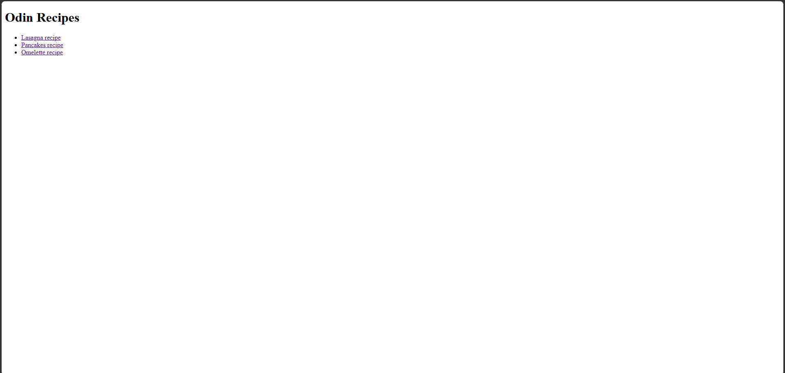
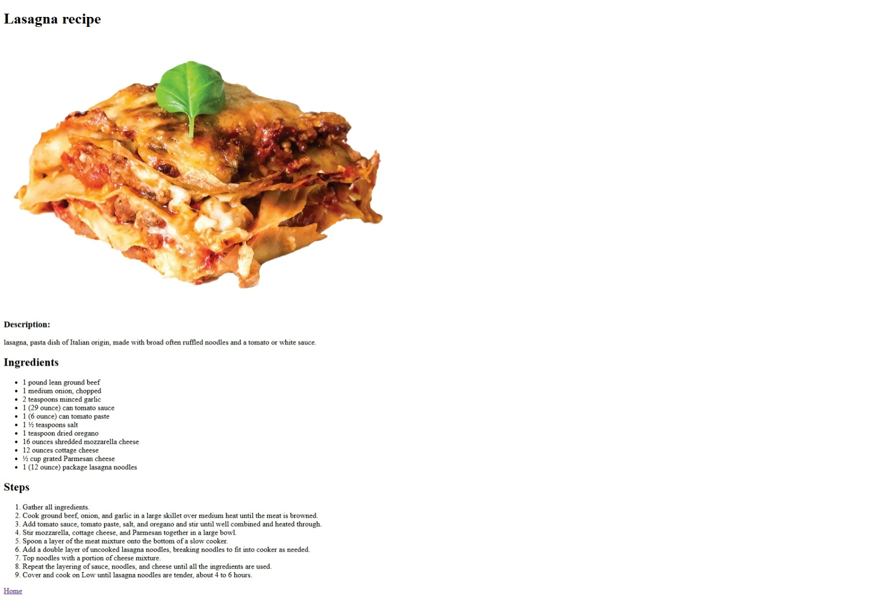

# Odin Recipes

A simple recipe website built as part of **The Odin Project Foundations Course**.

This project demonstrates the fundamentals of HTML by creating a multi-page website containing several recipes. Users can navigate from the homepage to individual recipe pages and view ingredients and preparation steps.

## Features

- Homepage with links to recipes
- Multiple recipe pages
- Structured HTML using:
  - Headings
  - Paragraphs
  - Images
  - Unordered lists
  - Ordered lists
  - Links
- Simple and beginner-friendly layout

## Recipes Included

-  Lasagna
-  Pancakes
-  Omelette

## Project Structure

```text
odin-recipes/
│
├── index.html
│
├── recipes/
│   ├── lasagna.html
│   ├── pancakes.html
│   └── omelette.html
│
├── lasagna-image.jpg
├── pancakes-image.jpg
└── omelette-image.jpg
```
## Screenshot





## Technologies Used

- HTML5

## What I Learned

Through this project, I practiced:

- Creating HTML documents
- Working with headings and paragraphs
- Adding images to a webpage
- Creating ordered and unordered lists
- Creating links between pages
- Organizing a simple project structure
- Using relative file paths


## Future Improvements

- Add CSS styling
- Improve page layout and design
- Make the website responsive
- Add more recipes
- Include nutritional information
- Add cooking tips and preparation times

## Acknowledgements

This project was completed as part of the Foundations curriculum from The Odin Project.

